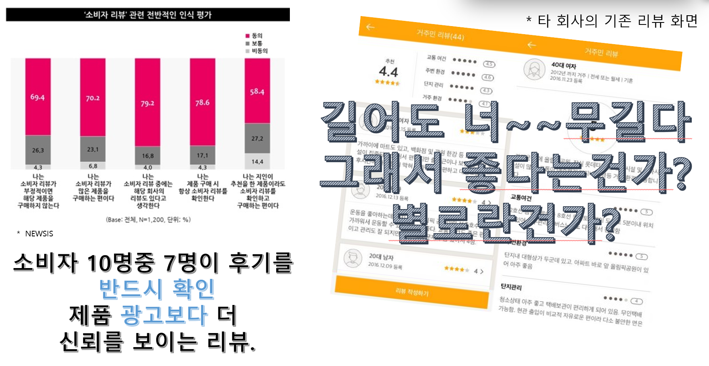

# HappyHouse

# 목적

- 리뷰들을 더욱 빠르게 파악하기 위한 시각적 자료를 통해서 사용자의 편의를 돕기

# 개발 환경

# 핵심 알고리즘

---

# UseCase

---

# ERD

---

# 화면 설계

---

---

- 프로젝트 기간 : 5월20일 ~ 5월 26일 (1주일)
- 팀 : 2
- 역할 : 프론트, 백엔드 개발
